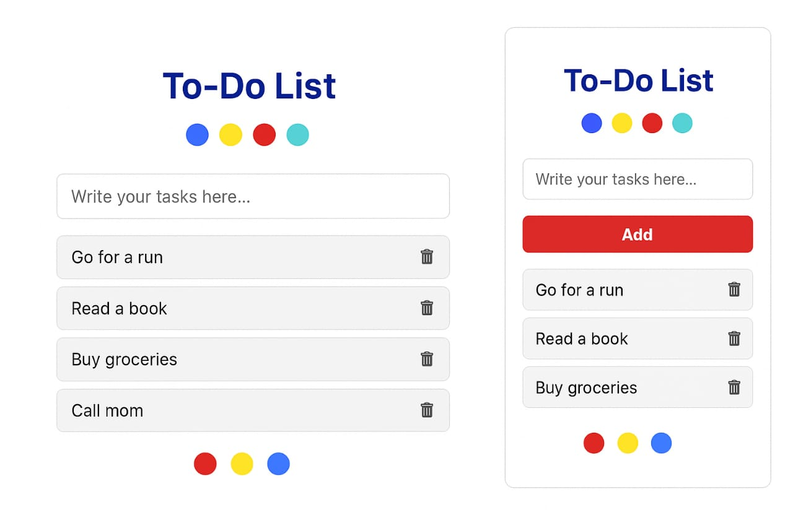

# 📝 To-Do App# 📝 To-Do App

A simple and responsive To-Do List Application built using HTML, CSS, and JavaScript.  
This app allows you to add, delete, and manage your daily tasks easily.

---

## 🚀 Features
- ➕ Add new tasks
- ❌ Delete tasks
- 🎨 Simple and clean UI
- 📱 Responsive design (works on mobile & desktop)
- ⚡ Fast and lightweight

---

## 📸 Screenshot

Click the image below to view full size:

---